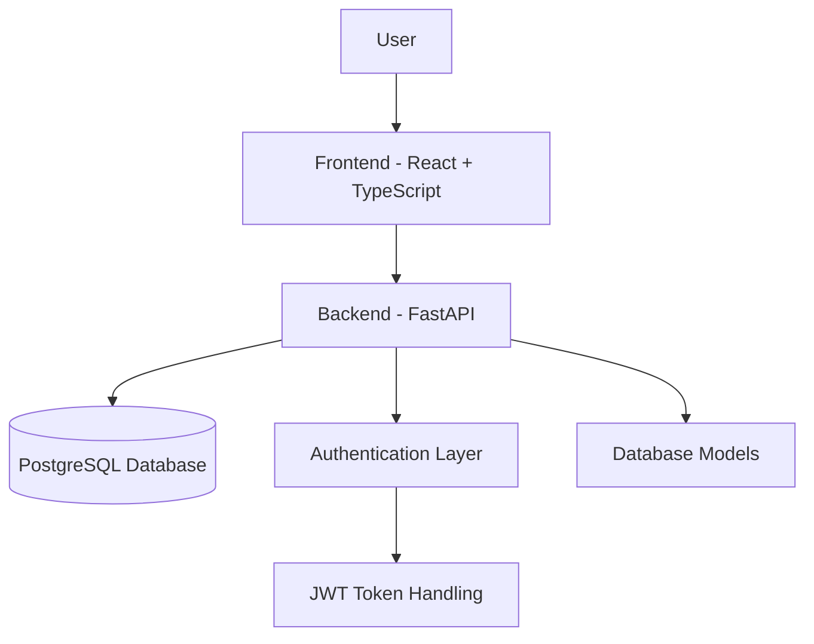

# AI SOC Assistant – Milestone Repository (Sprint 4)

## Overview

This repository presents the **project state up to Sprint 4** of the **AI SOC Assistant** development process.

The goal of this milestone is to demonstrate the transition from planning and design into actual implementation. At this stage, the project already includes:

- Backend foundation using **FastAPI**
- Database structure using **PostgreSQL** and **SQLAlchemy**
- User authentication flow using **JWT** and password hashing
- Initial frontend structure using **React + TypeScript + Vite**
- Basic routing and protected access flow
- Supporting design and architecture documentation

This repository is intended for **academic presentation purposes** and reflects the system before the implementation of the advanced AI orchestration planned for later sprints.

---

## Milestone Scope

### Included in this repository

- Backend application skeleton
- Database connection and entity models
- Authentication endpoints (`register`, `login`, `me`)
- Initial frontend structure
- Login and Register pages
- Protected routing logic
- Documentation and diagrams for Sprint 3 and Sprint 4

### Not included in this milestone

The following features belong to later sprints and are intentionally excluded from this milestone repository:

- AI Orchestrator logic
- Specialist agents (Network / Identity / Policy)
- Advanced chat processing
- Conversation history management
- Guardrails and prompt filtering
- Admin features
- Extended testing and refinement tasks

---

## Sprint Focus

### Sprint 3

Sprint 3 focused on the **initial technical foundation** of the project:

- Backend setup
- Database design and model implementation
- Frontend project initialization

### Sprint 4

Sprint 4 focused on turning the system into an **initially usable product**:

- Authentication and API integration
- User-to-database connection
- Login / Register UI
- Protected routing and frontend-backend communication

For a detailed work breakdown, see: [`docs/sprint-3-4-summary.md`](docs/sprint-3-4-summary.md)

---

## Repository Structure

```text
AI-SOC-ASSISTANT_Sprints/
├── README.md
├── docs/
│   ├── architecture.md
│   ├── erd.md
│   ├── use-case-diagram.md
│   ├── sequence-diagram.md
│   └── sprint-3-4-summary.md
├── backend/
└── frontend/
```

---

## Architecture Summary

At this stage, the system is composed of three main layers:

1. **Frontend** – user-facing interface built with React.
2. **Backend** – REST API built with FastAPI.
3. **Database** – PostgreSQL database accessed through SQLAlchemy.

### High-Level Architecture



A more detailed version appears in [`docs/architecture.md`](docs/architecture.md).

---

## Main Technologies Used

| Layer | Technology |
|---|---|
| Frontend | React, TypeScript, Vite, React Router |
| Backend | Python, FastAPI, Uvicorn |
| Database | PostgreSQL, SQLAlchemy |
| Authentication | JWT, Passlib |
| Documentation | Markdown, Mermaid |

---

## Main Deliverables up to Sprint 4

- Functional backend foundation
- Database model design and implementation
- Authentication endpoints and token-based login
- Initial frontend pages for Login and Register
- Protected route structure
- Technical documentation and diagrams

---

## Documentation Index

- [Architecture](docs/architecture.md)
- [ERD](docs/erd.md)
- [Use Case Diagram](docs/use-case-diagram.md)
- [Sequence Diagram](docs/sequence-diagram.md)
- [Sprint 3–4 Summary](docs/sprint-3-4-summary.md)

---

## Notes

This repository is a **milestone snapshot** and does not represent the final project state.
It is intentionally limited to the functionality and implementation scope relevant to **Sprint 3** and **Sprint 4**.
=======
# AI-SOC-ASSISTANT_Sprints
Milestone repository presenting the project state up to Sprint 4, including architecture, authentication flow, database design, and initial frontend/backend integration.
>>>>>>> 453e4f0bbb91110194a37967fcf582c521380c1d
