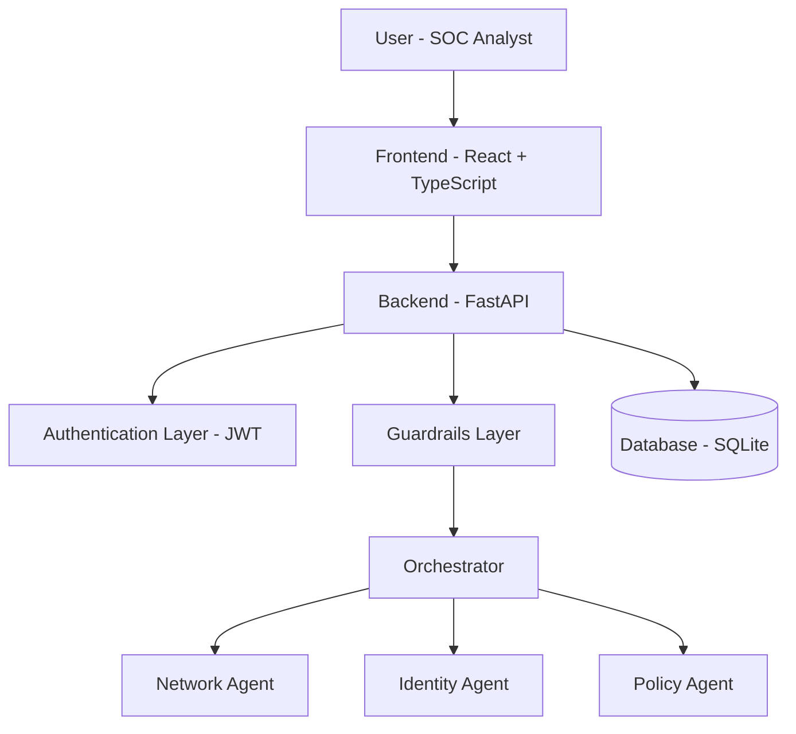

# AI SOC Assistant - Final Project Repository

## Overview

This repository presents the **complete project state** of the **AI SOC Assistant**, developed across eight sprints (Sprints 1-8).

The project simulates a SOC (Security Operations Center) assistant that helps an analyst triage security alerts using a multi-agent architecture. An analyst pastes a security event, log line, or question; an **orchestrator** classifies the intent and routes the request to one of three specialist agents (**Network**, **Identity**, or **Policy**), which return a severity-rated, structured triage recommendation (Summary, IOCs, MITRE ATT&CK mapping, recommended actions, and escalation path). Input and output **guardrails** block prompt-injection attempts and off-topic input.

This repository contains the deliverables of all eight sprints and is intended for **academic presentation purposes**.

---

## Sprint Breakdown

### Sprint 1 - Scope and Domain Design

- Project scope definition and problem statement
- System entities and ERD design
- Use Case Diagram (login, chat, history, admin interactions)
- Requirements consolidation and feature backlog

### Sprint 2 - Architecture and Planning

- High-level architecture definition (frontend, backend, database, LLM)
- Database schema review and constraints
- Sequence Diagram for end-to-end request flow
- Frontend wireframe and navigation planning

### Sprint 3 - Technical Foundation

- FastAPI project setup and base configuration
- SQLAlchemy models (`User`, `Conversation`, `Message`)
- React + Vite frontend initialization with routing and base layout
- Environment configuration and local setup guide

### Sprint 4 - Authentication Layer

- Authentication logic (register, login, token handling, user validation)
- Password hashing and JWT support utilities
- Login and Register pages
- Protected routes and auth context integration

### Sprint 5 - Chat Core

- Chat endpoint implementation
- Conversation persistence and retrieval
- Chat page UI with message rendering and session flow
- API client integration between frontend and backend

### Sprint 6 - Multi-Agent AI Logic

- Orchestrator routing logic across domain-specific agents
- Specialized agent prompt structure (Network / Identity / Policy)
- Conversation history page
- Admin page structure and navigation

### Sprint 7 - Guardrails and Integration

- Input and output guardrails (prompt-injection and off-topic filtering)
- Backend validation and edge-case fixes
- Frontend integration polishing and UI fixes
- CORS and end-to-end local integration adjustments

### Sprint 8 - Testing, Documentation, and Release

- Unit tests for authentication, routing, and guardrails
- README and API documentation updates
- Final presentation material and project write-up
- Final QA pass and release readiness review

For a more detailed work breakdown, see [`docs/sprint-3-4-summary.md`](docs/sprint-3-4-summary.md).

---

## Architecture Summary

The system is composed of four main layers:

1. **Frontend** - user-facing interface built with React + TypeScript + Vite.
2. **Backend** - REST API built with FastAPI.
3. **Database** - SQLite accessed through SQLAlchemy.
4. **AI orchestration** - an orchestrator agent that classifies the request and routes it to one of three specialist agents (Network, Identity, Policy), protected by input/output guardrails.

### High-Level Architecture



A more detailed version appears in [`docs/architecture.md`](docs/architecture.md).

---

## Main Technologies Used

| Layer | Technology |
|---|---|
| Frontend | React, TypeScript, Vite, React Router |
| Backend | Python, FastAPI, Uvicorn |
| Database | SQLite, SQLAlchemy |
| Authentication | JWT (python-jose), Passlib (pbkdf2_sha256) |
| AI / LLM | Groq API (`llama-3.3-70b-versatile`) - optional |
| Testing | pytest, pytest-asyncio |
| Documentation | Markdown, Mermaid |

---

## Repository Structure

```text
AI-SOC-ASSISTANT/
|-- README.md
|-- docs/
|   |-- architecture.md
|   |-- erd.md
|   |-- use-case-diagram.md
|   |-- sequence-diagram.md
|   `-- sprint-3-4-summary.md
|-- backend/
|   |-- main.py
|   |-- requirements.txt
|   |-- .env.example
|   |-- auth/                 # register, login, JWT, password reset
|   |-- database/             # SQLAlchemy engine + models (User, Conversation, Message, SecurityEvent, GuardrailPolicy, ...)
|   |-- agents/               # Orchestrator + Network / Identity / Policy
|   |-- guardrails/           # Input and output safety checks
|   |-- api/                  # chat, conversations, admin routes
|   `-- tests/                # auth, routing, guardrails
`-- frontend/
    `-- src/
        |-- pages/            # Login, Register, ForgotPassword, Chat, History, Admin
        |-- components/       # Layout, ProtectedRoute
        |-- context/          # AuthContext
        `-- api/              # typed API client
```

---

## Main Deliverables

- Authentication system with register, login, password reset, account lockout, and protected routes
- Multi-agent orchestrator with Network, Identity, and Policy specialist agents
- Severity triage and structured incident output (Summary, IOCs, MITRE ATT&CK, Recommended Actions, Escalation Path) on every agent response
- Chat interface with conversation persistence, light/dark theme, and Markdown rendering
- Conversation history with search and filtering by agent, risk level, and time, plus resume-chat
- Input and output guardrails against prompt injection and unsafe content, with admin-managed custom guardrail policies
- Security audit logging of logins, routing decisions, and guardrail blocks
- Admin dashboard with user management (roles, activate/deactivate, unlock, delete), audit log, routing decisions, and guardrail policy management
- SQLAlchemy data models and database connection layer
- Unit tests for authentication, routing, guardrails, and severity triage
- Architecture, ERD, use case, and sequence diagrams
- Local development setup and run instructions

---

## How to Run Locally

### Prerequisites

- Python 3.10+ (3.12 tested)
- Node.js 18+ (20 tested)

### Backend

```bash
cd backend
python -m venv .venv
source .venv/bin/activate          # Windows: .\.venv\Scripts\Activate.ps1
pip install -r requirements.txt
cp .env.example .env               # Windows: copy .env.example .env
python -m uvicorn main:app --reload --port 8000
```

### Frontend

```bash
cd frontend
npm install
npm run dev
```

Open the app at <http://localhost:5173>.
Interactive API docs are available at <http://localhost:8000/docs>.

### Demo Users (seeded on first startup)

| Email | Password | Role |
|---|---|---|
| `analyst@socdemo.com` | `Analyst123!` | analyst |
| `admin@socdemo.com` | `Admin123!` | admin |

The `GROQ_API_KEY` environment variable is **optional**. If it is not set, the system runs in demo mode: the orchestrator still classifies each request and each specialist agent returns a template defensive playbook so the full flow can be demonstrated without an external API key.

### Running Tests

```bash
cd backend
source .venv/bin/activate
pytest
```

---

## Documentation Index

### System design
- [Architecture](docs/architecture.md)
- [ERD](docs/erd.md)
- [Use Case Diagram](docs/use-case-diagram.md)
- [Sequence Diagram](docs/sequence-diagram.md)

### Security analysis (cybersecurity presentation)
- [Security Analysis – STRIDE & Risk Matrix](docs/security-analysis.md)
- [Guardrails – Worked Examples](docs/guardrails.md)
- [Security Validation & Testing Report](docs/security-testing.md)

### Sprint deliverables
- [Sprint 3-4 Summary](docs/sprint-3-4-summary.md)

---

## Contributors

| Name | Primary focus |
|---|---|
| Maor Kurztag | Project planning, backend, AI orchestration, guardrails, QA |
| Roi Noiman | Database design, security utilities, testing |
| Daniel Gorodnitskiy | Frontend, UX, design diagrams, presentation |

---

## Notes

This repository represents the **complete academic deliverable** for the AI SOC Assistant project across Sprints 1-8. The system is intended for educational and presentation purposes and is not production-hardened.
