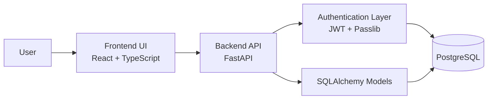
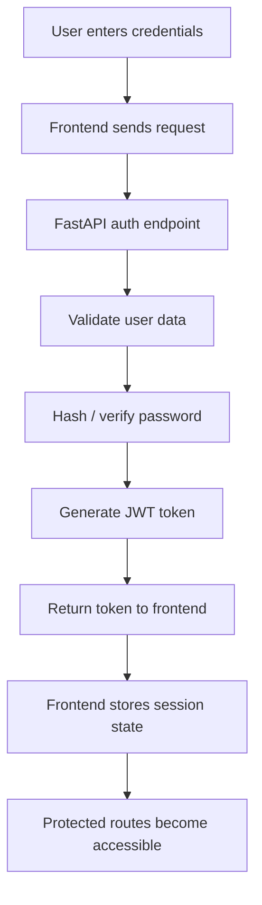

# Architecture

## Purpose

The purpose of the system is to provide the technical foundation for an **AI SOC Assistant** platform.
At the Sprint 4 milestone, the system focuses on user management, authentication, backend structure, database modeling, and frontend access flow.

---

## Architectural Layers

### 1. Frontend Layer

The frontend is responsible for user interaction.
It includes:

- Login page
- Register page
- Routing structure
- Protected route behavior
- Initial application shell

**Technologies:**
- React
- TypeScript
- Vite
- React Router

---

### 2. Backend Layer

The backend is responsible for:

- Receiving requests from the frontend
- Handling authentication logic
- Connecting to the database
- Returning structured responses

**Technologies:**
- Python
- FastAPI
- Uvicorn
- JWT
- Passlib

---

### 3. Database Layer

The database stores the system entities required for the project.
At this stage, the core structure is based on:

- Users
- Conversations
- Messages

Even though not all conversation functionality is presented in this milestone, the data model already supports future system expansion.

**Technologies:**
- PostgreSQL
- SQLAlchemy

---

## High-Level Architecture Diagram

---

## Authentication Flow in the Architecture

---

## Separation of Responsibilities

| Layer | Responsibility |
|---|---|
| Frontend | User interaction, forms, routing, protected UI access |
| Backend | Business logic, API routing, auth logic, request handling |
| Database | Persistent storage of users and system entities |
| Documentation | Project presentation, design communication, milestone tracking |

---

## Why This Architecture Was Chosen

This architecture was chosen because it is:

- **Modular** – clear separation between frontend, backend, and database
- **Scalable** – future AI and multi-agent components can be added later
- **Understandable** – easy to present in an academic setting
- **Practical** – based on common web application patterns

---

## Planned Future Extension

In later sprints, this architecture is expected to expand with:

- AI orchestration logic
- Specialist agents
- Chat processing flow
- Guardrails
- Conversation history management
- Admin and monitoring capabilities

These components are intentionally excluded from this repository because this milestone is limited to the scope of Sprint 3 and Sprint 4.
