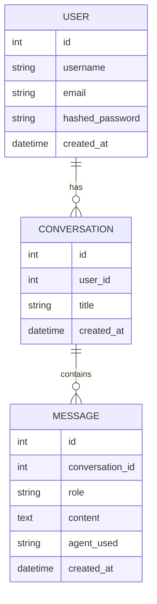

# ERD – Entity Relationship Diagram

## Overview

The database design supports the core entities of the AI SOC Assistant system.

At this milestone, the most important entity flow begins with **User** authentication. The model also includes **Conversation** and **Message** entities to support future system expansion.

---

## Main Entities

### User
Represents a registered system user.

### Conversation
Represents a conversation session that belongs to a user.

### Message
Represents a single message inside a conversation.

---

## Entity Relationship Diagram

---

## Relationship Explanation

### User → Conversation
- One user can have multiple conversations.
- Each conversation belongs to exactly one user.

### Conversation → Message
- One conversation can contain multiple messages.
- Each message belongs to exactly one conversation.

---

## Why These Entities Matter at Sprint 4

Even though the milestone presentation mainly focuses on backend setup and authentication, the database model already reflects the long-term project structure.

This is useful because it shows:

- forward planning
- scalable data design
- readiness for future features such as chat history and agent-based responses

---

## Sprint Mapping

### Sprint 3
- Database planning
- Entity design
- Relationship modeling
- SQLAlchemy model implementation

### Sprint 4
- User-related database integration
- Authentication flow tied to stored users
- Backend access to persistent user data
