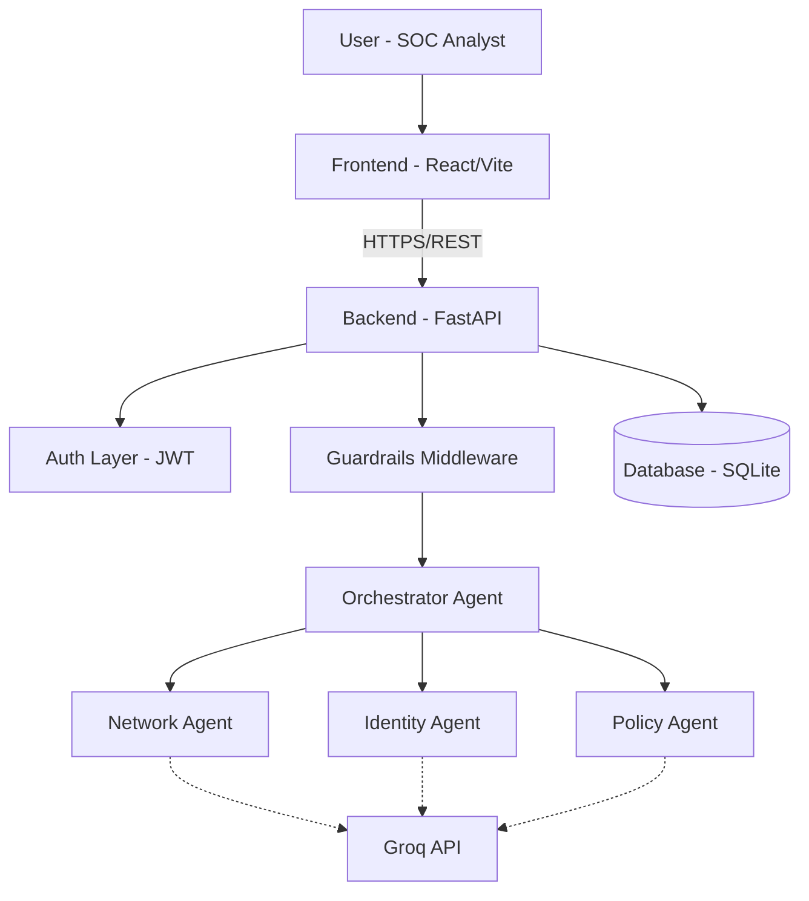
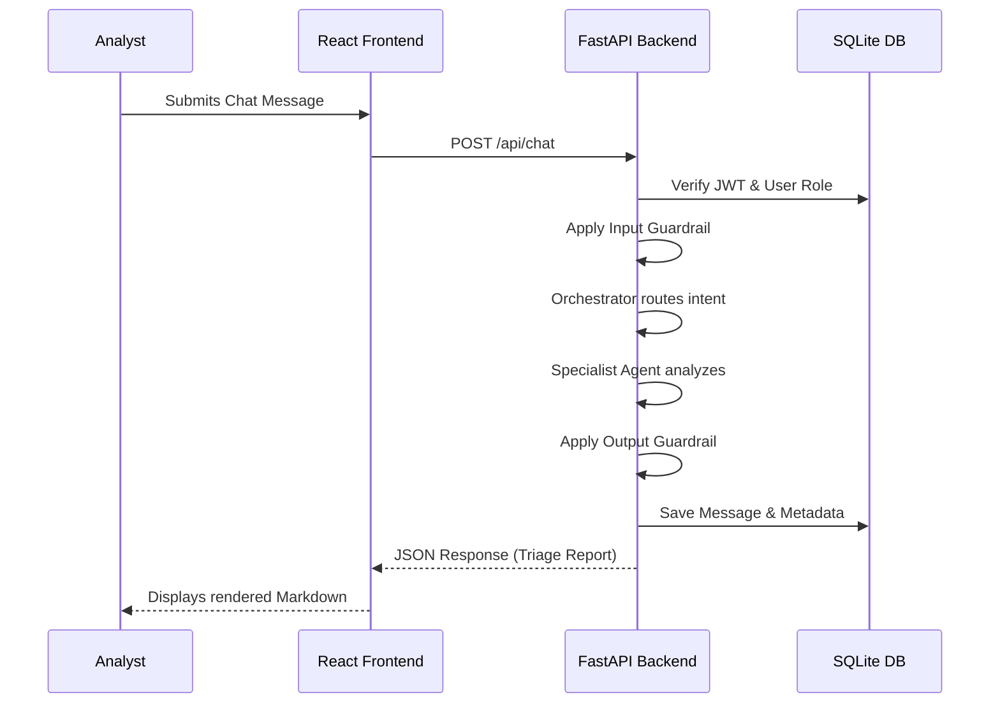
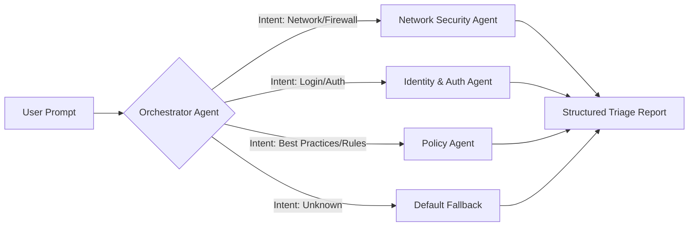
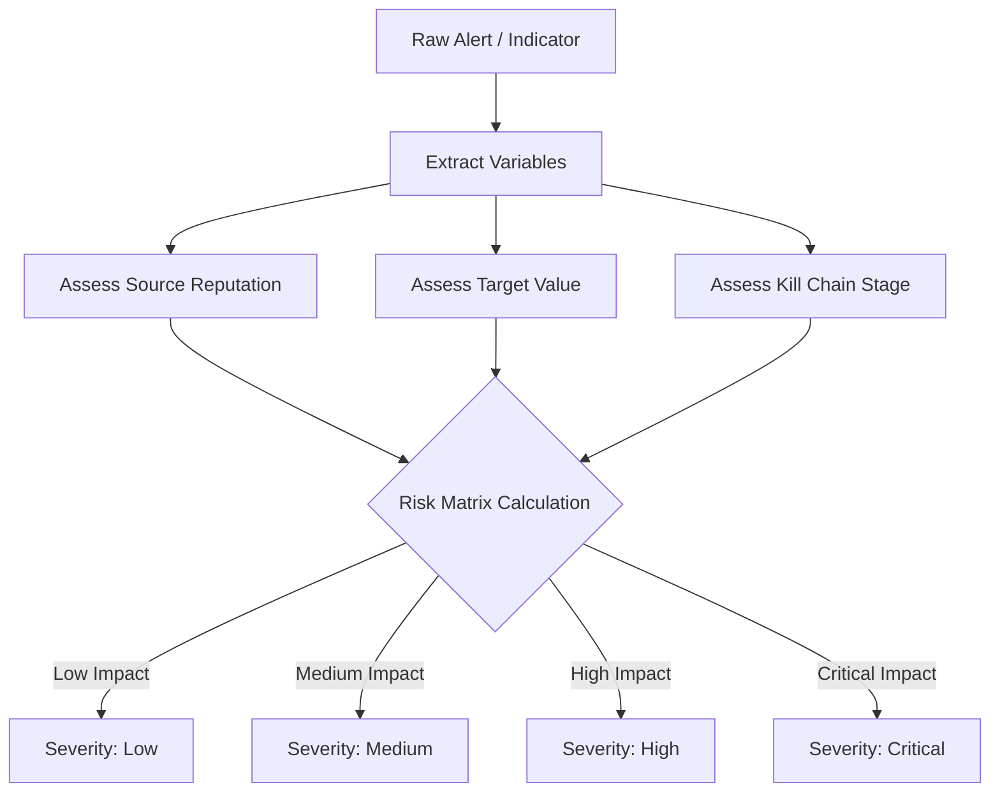
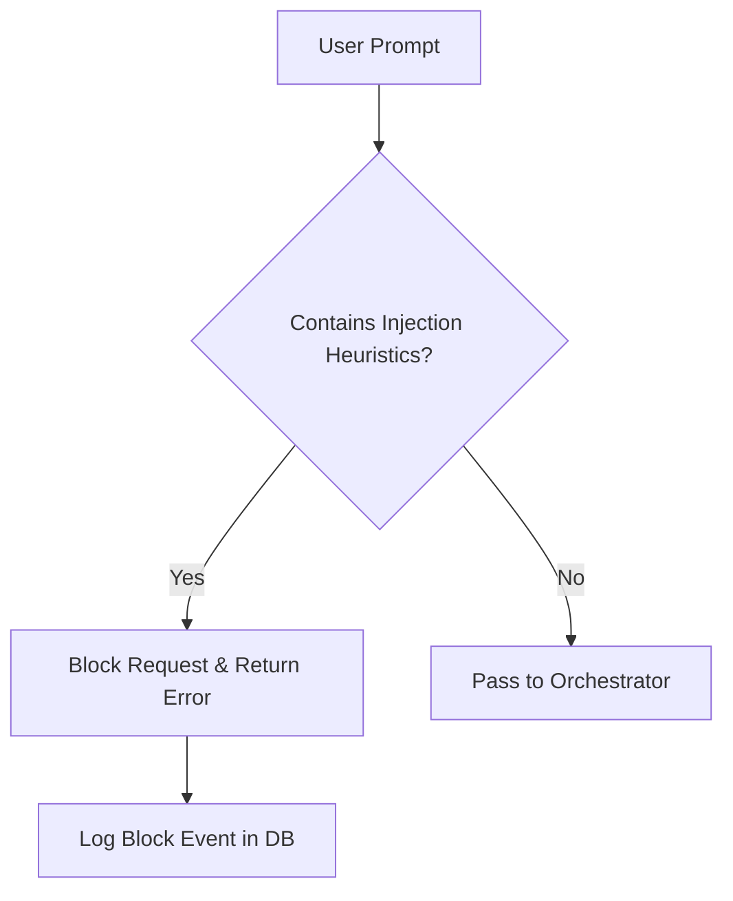

# System Diagrams

## High-Level Architecture

```mermaid
flowchart TD
    U[User - SOC Analyst] --> F[Frontend - React/Vite]
    F -->|HTTPS/REST| B[Backend - FastAPI]
    B --> A[Auth Layer - JWT]
    B --> G[Guardrails Middleware]
    G --> O[Orchestrator Agent]
    O --> N[Network Agent]
    O --> I[Identity Agent]
    O --> P[Policy Agent]
    B --> D[(Database - SQLite)]
    N -.-> LLM[Groq API]
    I -.-> LLM
    P -.-> LLM
```

## User Request Flow

```mermaid
sequenceDiagram
    participant Analyst
    participant React Frontend
    participant FastAPI Backend
    participant SQLite DB
    Analyst->>React Frontend: Submits Chat Message
    React Frontend->>FastAPI Backend: POST /api/chat
    FastAPI Backend->>SQLite DB: Verify JWT & User Role
    FastAPI Backend->>FastAPI Backend: Apply Input Guardrail
    FastAPI Backend->>FastAPI Backend: Orchestrator routes intent
    FastAPI Backend->>FastAPI Backend: Specialist Agent analyzes
    FastAPI Backend->>FastAPI Backend: Apply Output Guardrail
    FastAPI Backend->>SQLite DB: Save Message & Metadata
    FastAPI Backend-->>React Frontend: JSON Response (Triage Report)
    React Frontend-->>Analyst: Displays rendered Markdown
```

## Orchestrator Routing Flow

```mermaid
flowchart LR
    Msg[User Prompt] --> O{Orchestrator Agent}
    O -- Intent: Network/Firewall --> N[Network Security Agent]
    O -- Intent: Login/Auth --> I[Identity & Auth Agent]
    O -- Intent: Best Practices/Rules --> P[Policy Agent]
    O -- Intent: Unknown --> D[Default Fallback]
    N --> Output[Structured Triage Report]
    I --> Output
    P --> Output
    D --> Output
```

## Risk Severity Reasoning Flow

```mermaid
flowchart TD
    Input[Raw Alert / Indicator] --> E[Extract Variables]
    E --> Source[Assess Source Reputation]
    E --> Target[Assess Target Value]
    E --> Stage[Assess Kill Chain Stage]
    Source --> Matrix
    Target --> Matrix
    Stage --> Matrix
    Matrix{Risk Matrix Calculation}
    Matrix -- Low Impact --> Low[Severity: Low]
    Matrix -- Medium Impact --> Med[Severity: Medium]
    Matrix -- High Impact --> High[Severity: High]
    Matrix -- Critical Impact --> Crit[Severity: Critical]
```

## Prompt Injection Blocking Flow

```mermaid
flowchart TD
    Input[User Prompt] --> Filter[Input Guardrail Scanner]
    Filter{Contains Injection Heuristics?}
    Filter -- Yes --> Block[Block Request & Return Error]
    Block --> Audit[Log Block Event in DB]
    Filter -- No --> Process[Pass to Orchestrator]
```