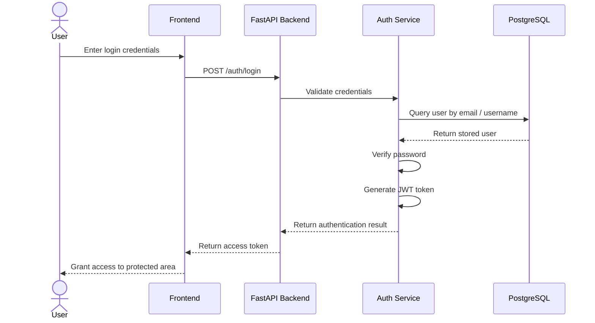
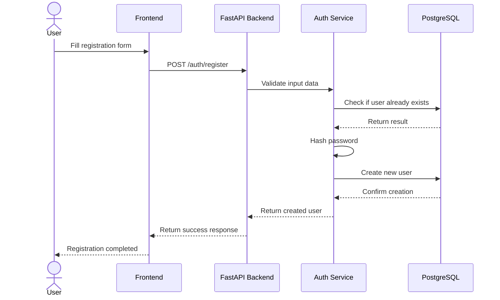

# Sequence Diagram

## Purpose

This sequence describes the main flow implemented and presented up to Sprint 4:

- User submits credentials
- Frontend sends request to backend
- Backend validates and authenticates the user
- Database is queried
- JWT token is returned
- User gains access to protected routes

---

## Login Flow Sequence Diagram

---

## Register Flow Sequence Diagram

---

## Why This Diagram Fits Sprint 4

This sequence is important because Sprint 4 is the stage where the system stops being only a structural prototype and begins behaving like a real application.

It demonstrates:

- frontend-backend communication
- authentication handling
- database usage
- protected access behavior

---

## Planned Future Sequence Extensions

Later milestones are expected to extend the flow with:

- chat request handling
- AI routing
- specialist agents
- conversation persistence
- guardrail checks

These are intentionally not part of the current milestone.
