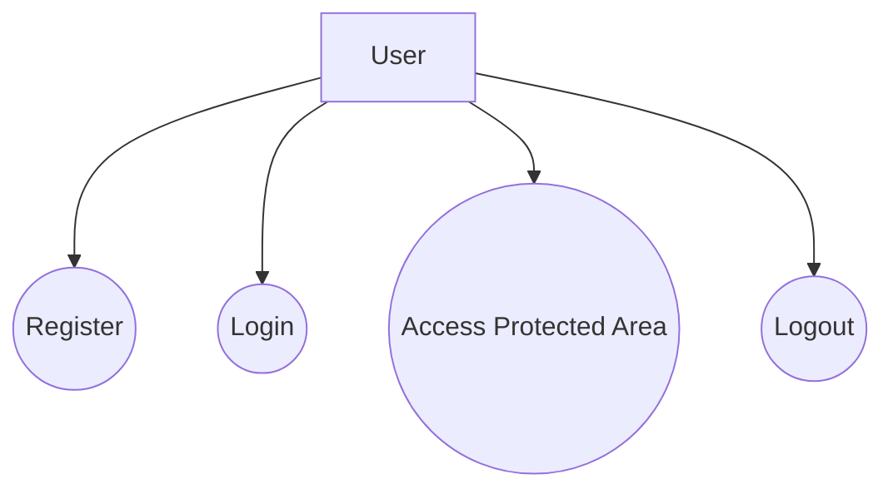

# Use Case Diagram

## Purpose

The purpose of this diagram is to describe the main user interactions supported by the system up to Sprint 4.

At this milestone, the system focuses on:

- User registration
- User login
- Access to protected application areas
- Basic system entry flow

---

## Main Actor

- **User** – the person interacting with the application

---

## Use Case Diagram

---

## Use Case Descriptions

### Register
The user creates a new account by submitting registration details.

### Login
The user enters valid credentials and receives authenticated access.

### Access Protected Area
After successful authentication, the user can access application areas restricted to logged-in users.

### Logout
The user ends the authenticated session and returns to a public state.

---

## Notes

At this stage, the system does **not yet** present the advanced AI-specific use cases planned for later sprints, such as:

- Sending SOC-related prompts to specialized agents
- Viewing full conversation history
- Admin operations
- Guardrail-triggered flows

These use cases belong to future milestones and are intentionally outside the scope of Sprint 4.
